# Campus Spots — `claude-uml-diagram`

A from-source UML walkthrough of the entire app: routing, components, hooks, services, Cloud Functions, Firestore data/security model, and deployment. Every diagram below was checked against the current code (not an older spec), so file paths are exact and you can jump straight to the implementation.

All diagrams use [Mermaid](https://mermaid.js.org/). Most editors/GitHub render them automatically.

---

## 0. How this document is organized

| # | Section | What it answers |
|---|---------|------------------|
| 1 | System context | Who uses the app, what external systems it talks to |
| 2 | Container/component view | The big modules and how they depend on each other |
| 3 | Screen & component tree | What renders what, down to leaf components |
| 4 | Domain model | The TypeScript types and how a Firestore doc becomes a `Place` |
| 5 | Hooks as state machines | The `useSyncExternalStore` pattern used for shared state |
| 6 | Navigation/startup flow | How the app decides Welcome vs. Tabs |
| 7 | Realtime data flow | Seed → Firestore → `onSnapshot` → screens |
| 8 | Check-in sequence | The full client → Cloud Function → transaction path |
| 9 | Check-in button state machine | UI-level guard against double submits |
| 10 | Admin authorization & overrides | Two independent authorization layers |
| 11 | Scheduled aggregation algorithm | How `busyPercent` is computed every 5 minutes |
| 12 | Scheduled cleanup algorithm | Retention/deletion job |
| 13 | Firestore ER model | Collections, keys, and who can touch them |
| 14 | Security model | Rules + callable validation, defense in depth |
| 15 | Deployment & tooling | Expo/EAS, Firebase, emulators, scripts |
| 16 | Design tokens | The theme system class diagram |
| 17 | Known dead code & caveats | Things that exist in source but aren't wired up |
| 18 | Reading guide | Suggested order to read the actual source |

---

## 1. System context

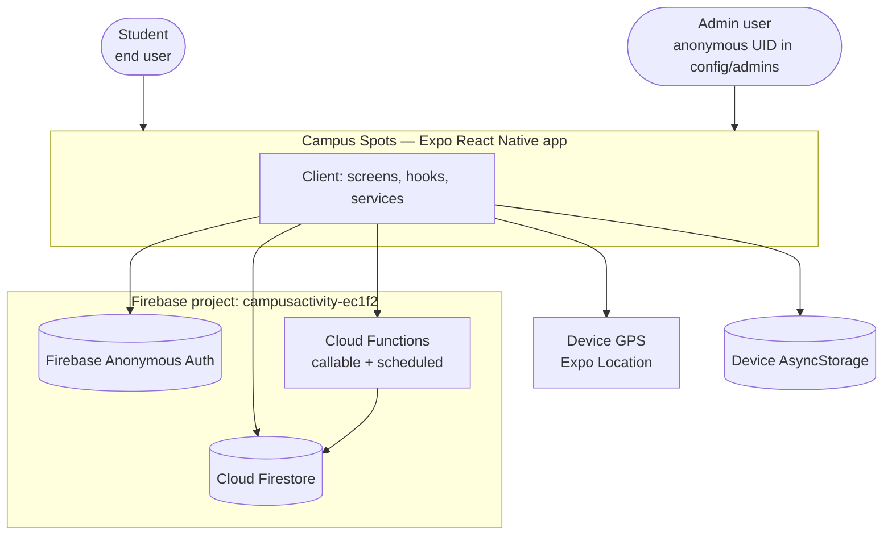

**Key fact:** there is no traditional backend server. The "backend" is entirely Firebase: anonymous auth (no accounts/passwords), Firestore as the database, and two kinds of Cloud Functions (`onCall` for client-invoked logic, `onSchedule` for cron-style jobs).

---

## 2. Container / component view

This is effectively a component diagram: which layer is allowed to depend on which.

```mermaid
flowchart TB
    subgraph routing ["app/ — Expo Router (file-based routes)"]
        rootLayout["_layout.tsx\nRootLayout"]
        idx["index.tsx\nstartup redirect"]
        welcome["(auth)/welcome.tsx"]
        tabsLayout["(tabs)/_layout.tsx"]
        mapScreen["(tabs)/index.tsx\nMapScreen"]
        placesScreen["(tabs)/places.tsx\nPlacesScreen"]
        detailScreen["place/[id].tsx\nPlaceScreen"]
    end

    subgraph hooksLayer ["hooks/ — shared + local state"]
        useAuth["useAuth\n(module store)"]
        useLocation["useLocation\n(module store)"]
        usePlaces["usePlaces\n(module store)"]
        useCheckIn["useCheckIn\n(local state)"]
        useAdmin["useAdmin\n(local state)"]
        useProximity["useProximity\n(derived, UNUSED)"]
    end

    subgraph servicesLayer ["services/ + utils/ — I/O adapters"]
        authService
        locationService
        placeService
        checkInService
        adminService
        proximityService["proximityService (UNUSED by UI)"]
        distanceUtil["utils/distance.ts"]
    end

    subgraph componentsLayer ["components/ — presentational"]
        PlaceMarker
        PlaceCard
        CheckInButtons
        CooldownTimer
        StaleIndicator
        AdminOverridePanel
        FloatingTabBar
        AppErrorBoundary
    end

    subgraph platform ["Platform / Firebase SDKs"]
        firebaseAuthSdk["firebase/auth"]
        firestoreSdk["firebase/firestore"]
        functionsSdk["firebase/functions"]
        expoLocationSdk["expo-location"]
        asyncStorageSdk["AsyncStorage"]
    end

    rootLayout --> useAuth
    rootLayout --> AppErrorBoundary
    idx --> useLocation
    welcome --> useLocation
    tabsLayout --> FloatingTabBar
    mapScreen --> usePlaces
    mapScreen --> useLocation
    mapScreen --> PlaceMarker
    placesScreen --> usePlaces
    placesScreen --> PlaceCard
    detailScreen --> useAuth
    detailScreen --> useLocation
    detailScreen --> useCheckIn
    detailScreen --> useAdmin
    detailScreen --> placeService
    detailScreen --> distanceUtil
    detailScreen --> CheckInButtons
    detailScreen --> CooldownTimer
    detailScreen --> StaleIndicator
    detailScreen --> AdminOverridePanel

    useAuth --> authService
    useLocation --> locationService
    usePlaces --> placeService
    useCheckIn --> checkInService
    useAdmin --> adminService
    useProximity --> proximityService
    proximityService --> distanceUtil

    authService --> firebaseAuthSdk
    placeService --> firestoreSdk
    checkInService --> functionsSdk
    checkInService --> asyncStorageSdk
    checkInService --> authService
    adminService --> functionsSdk
    adminService --> firestoreSdk
    locationService --> expoLocationSdk
```

**Pattern worth learning — layered dependency direction:** screens never touch Firebase SDKs directly (`detailScreen --> placeService`, not `detailScreen --> firestoreSdk`). This means if you ever swapped Firestore for another database, only the `services/` folder would change. This is the **adapter/service layer pattern**.

---

## 3. Screen & component tree

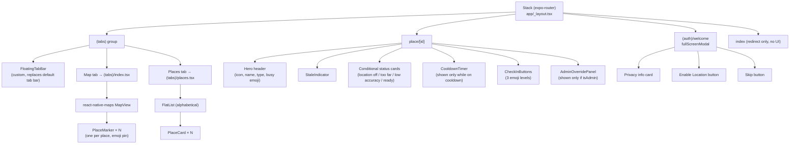

- Source of truth for markers/cards: `place.type` maps to an emoji via a local `PLACE_TYPE_ICONS` record duplicated in three places ([`components/map/PlaceMarker.tsx`](../components/map/PlaceMarker.tsx), [`components/places/PlaceCard.tsx`](../components/places/PlaceCard.tsx), [`app/place/[id].tsx`](../app/place/[id].tsx)) — a small duplication worth refactoring into one shared constant.
- `AppErrorBoundary` ([`components/AppErrorBoundary.tsx`](../components/AppErrorBoundary.tsx)) wraps the entire `<Stack>`, not individual screens, so a render error anywhere replaces the whole navigator with a retry screen.

---

## 4. Domain model (`types/index.ts`) and Firestore mapping

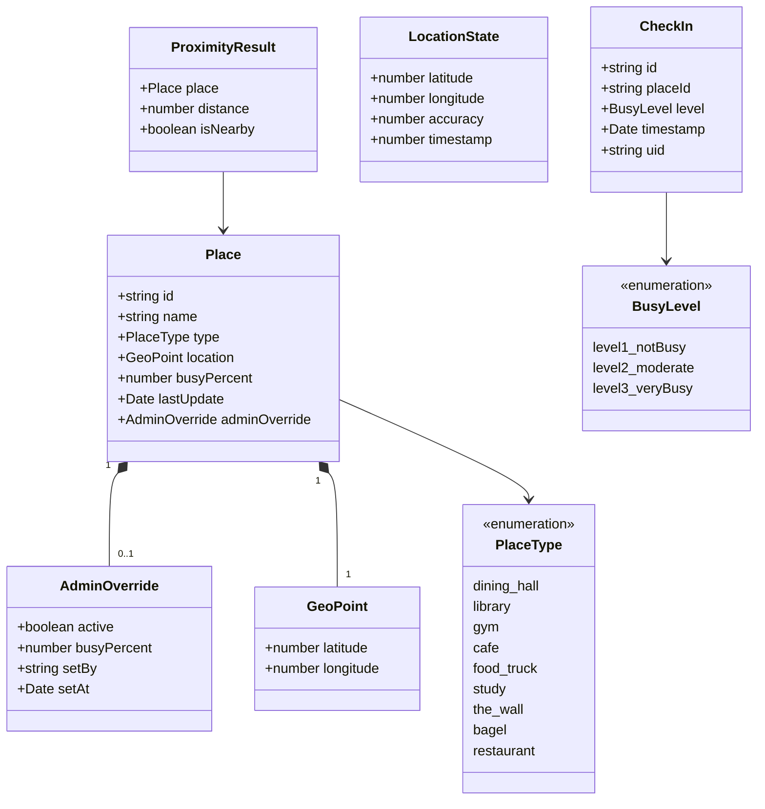

### Firestore document → domain object (`mapPlaceDocument`)

[`services/placeService.ts`](../services/placeService.ts) is a **validating mapper / anti-corruption layer**: it never trusts the raw Firestore document blindly.

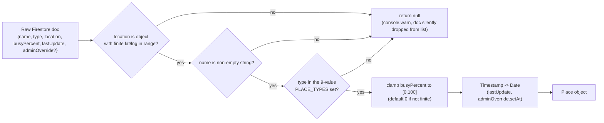

**Learning point:** because `subscribePlaces` filters out `null` results (`.filter((place): place is Place => place !== null)`), a malformed document in Firestore doesn't crash the app or show a broken card — it just silently disappears from the map/list. That's a deliberate trade-off between availability and strictness.

---

## 5. Hooks as state machines (the `useSyncExternalStore` pattern)

`useAuth`, `useLocation`, and `usePlaces` all use the **same pattern**: a module-level singleton object (outside React) plus a `Set` of listener callbacks, exposed to React via `useSyncExternalStore`. This means every component that calls `useAuth()` shares *one* Firebase subscription instead of each component creating its own.

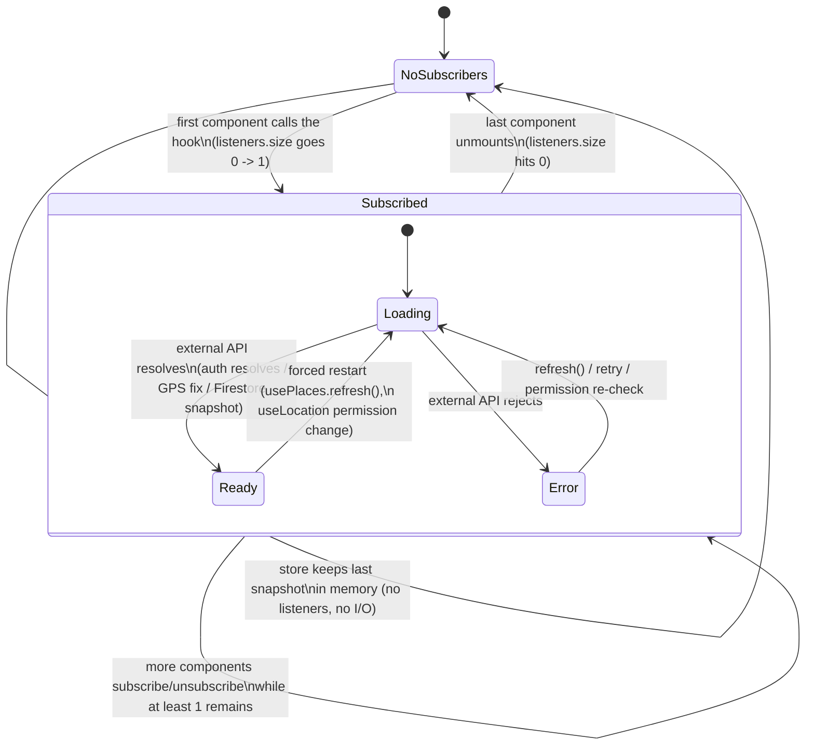

### Per-hook specifics

```mermaid
flowchart TB
    subgraph AuthStore ["useAuth module store — hooks/useAuth.ts"]
        A1["ensureAuthSubscription()\ncreates ONE onAuthStateChanged listener"]
        A2{"firebaseUser exists?"}
        A3["emit Ready snapshot with user+uid"]
        A4{"signInPromise\nalready in flight?"}
        A5["coalesce: just mark isLoading,\ndon't start a second sign-in"]
        A6["signInAnon() via authService\n(signInAnonymously)"]
        A1 --> A2
        A2 -- yes --> A3
        A2 -- no --> A4
        A4 -- yes --> A5
        A4 -- no --> A6
        A6 -- resolves --> A3
        A6 -- rejects --> A7["Error snapshot,\nhasResolved=true\n(retrySignIn() available)"]
    end

    subgraph LocationStore ["useLocation module store — hooks/useLocation.ts"]
        L1["ensurePermissionChecked()\ngetForegroundPermissionsAsync()"]
        L2{"permission granted?"}
        L3["ensureLocationWatcher()\nwatchPositionAsync, ONE subscription"]
        L4["stopLocationWatcher()\nno GPS use while denied/undetermined"]
        L5["AppState listener:\non foreground, re-check permission\n(no loading flicker if unchanged)"]
        L1 --> L2
        L2 -- yes --> L3
        L2 -- no --> L4
        L5 -.-> L1
    end

    subgraph PlacesStore ["usePlaces module store — hooks/usePlaces.ts"]
        P1["startPlacesSubscription()\nonSnapshot(collection 'places')"]
        P2["mapPlaceDocument per doc,\nfilter nulls, emit array"]
        P3["onError: null out the unsubscribe ref\nso refresh()/remount can restart it"]
        P4["refresh(): stop + start\n(used by pull-to-refresh & retry button)"]
        P1 --> P2
        P1 -. error .-> P3
        P4 --> P1
    end
```

### Hooks that keep **local** (non-shared) state

- `useCheckIn(placeId)` — [`hooks/useCheckIn.ts`](../hooks/useCheckIn.ts): scoped to one detail screen; uses an `inFlightRef` boolean to prevent overlapping `checkIn()` calls even before `setIsLoading` triggers a re-render.
- `useAdmin(uid)` — [`hooks/useAdmin.ts`](../hooks/useAdmin.ts): re-checks admin status via callable every time `uid` changes; uses a `cancelled` flag to avoid setting state after unmount.
- `useProximity(places, location)` — [`hooks/useProximity.ts`](../hooks/useProximity.ts): pure `useMemo` derivation, **not imported by any screen** (see §17). The detail screen recomputes distance inline instead.

---

## 6. Navigation & startup flow

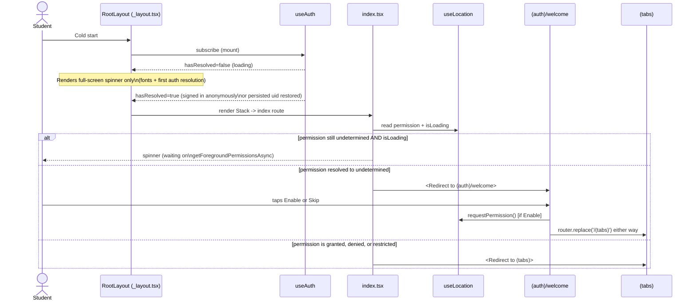

**Learning point — why `isLoading` is gated on `permission === 'undetermined'`:** `useLocation`'s `isLoading` stays `true` until the *first GPS fix* arrives, which can take a few seconds even after permission is granted. If `index.tsx` waited for `isLoading` to fully clear, every relaunch would show a spinner. Instead it only blocks while the *permission itself* is unknown, then immediately routes — the Map/Detail screens handle "no GPS fix yet" states independently.

---

## 7. Realtime places data flow

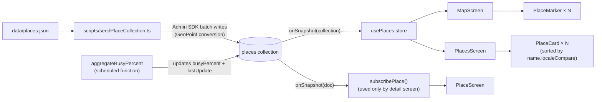

The client **never** writes `busyPercent` under normal operation — it's a derived/read-model field owned by the scheduled Cloud Function (or by an admin override).

---

## 8. Check-in sequence (client → callable → transaction)

This is the most security-sensitive flow in the app, so it's validated **twice**: once client-side for UX speed, once server-side because the client can't be trusted.

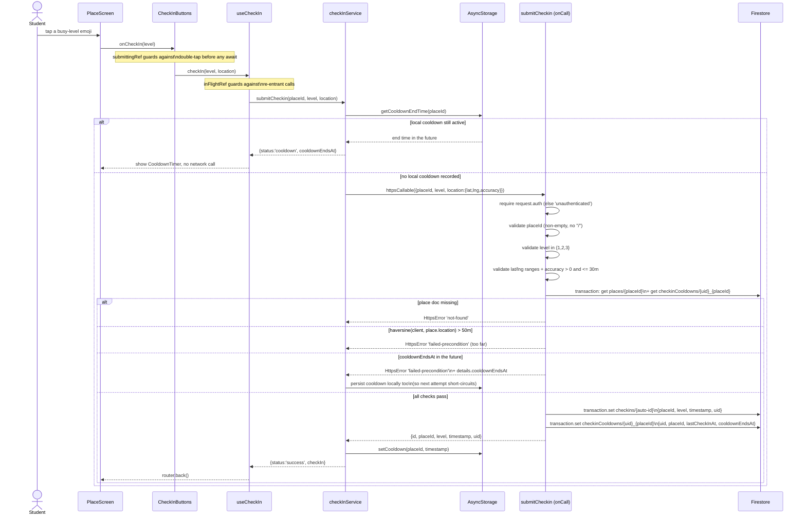

### Client-side gating vs. server-side authority

| Check | Client (`app/place/[id].tsx`) | Server (`functions/src/index.ts`) |
|---|---|---|
| Signed in | `!!uid && !authLoading` | `request.auth` required |
| Distance | `haversineDistance(...) <= CONFIG.CHECK_IN_RADIUS` (50m) | Recomputed server-side with the same formula, same 50m radius — **not trusted from client** |
| GPS accuracy | `location.accuracy <= CONFIG.MINIMUM_ACCURACY_TO_CHECK_IN` (30m) | Re-validated server-side (30m) |
| Cooldown | `AsyncStorage` lookup (fast, optimistic) | `checkinCooldowns/{uid}_{placeId}` document read inside the transaction (authoritative) |
| Level value | Fixed UI (only 3 buttons exist) | Explicitly checked `level === 1 \|\| 2 \|\| 3` |

**Golden rule demonstrated here:** the client's checks only affect *when the button is enabled* — they are convenience/UX, not security. The Cloud Function repeats every check because a user could call the callable directly (e.g. via curl with a forged auth token) and bypass the UI entirely.

---

## 9. `CheckInButtons` submission guard (UI state machine)

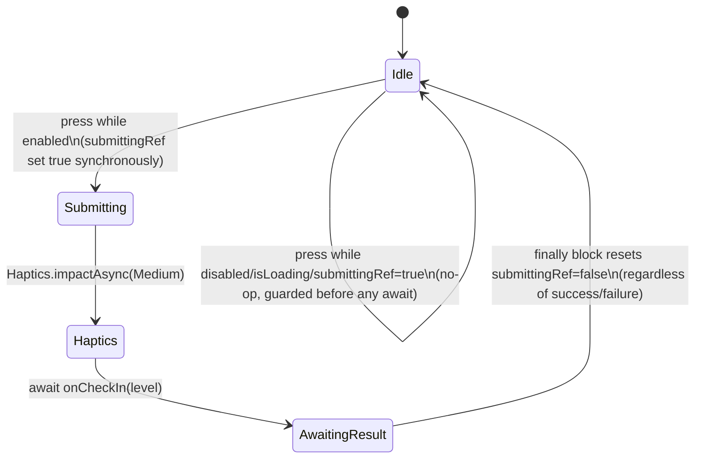

Two layers of guard exist simultaneously: `submittingRef` in the component (prevents a second tap before React even re-renders) and `inFlightRef` in `useCheckIn` (prevents a second logical call). This redundancy is intentional — the ref check happens *before* the `await Haptics.impactAsync(...)` call, closing a race window that `disabled` alone wouldn't close (props only update after a re-render).

---

## 10. Admin authorization & overrides

Two **independent** authorization layers protect admin actions — the callable function (so the UI knows whether to render the panel) and Firestore rules (so a forged direct write is still rejected even if someone reverse-engineers the callable).

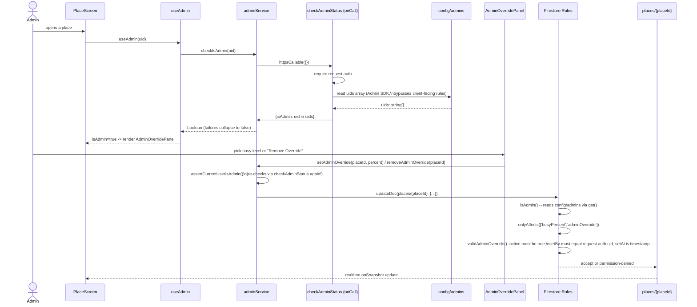

**Learning point — defense in depth in action:** even though `adminService.setAdminOverride` already called `assertCurrentUserIsAdmin()` client-side, the Firestore rule *also* calls `isAdmin()`. If a non-admin user patched their local JS bundle to skip the client check, the rule would still reject the write, because `request.auth.uid` can't be forged.

### Admin data model

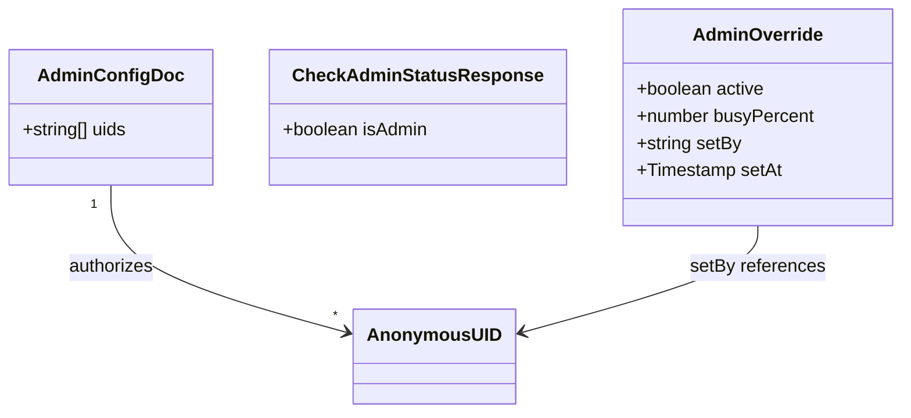

`config/admins` is denied to **all** client reads (`allow read, write: if false`), so the admin UID list can never be enumerated by inspecting network traffic — only the boolean result of `checkAdminStatus` is exposed.

---

## 11. Scheduled aggregation algorithm (`aggregateBusyPercent`, every 5 minutes)

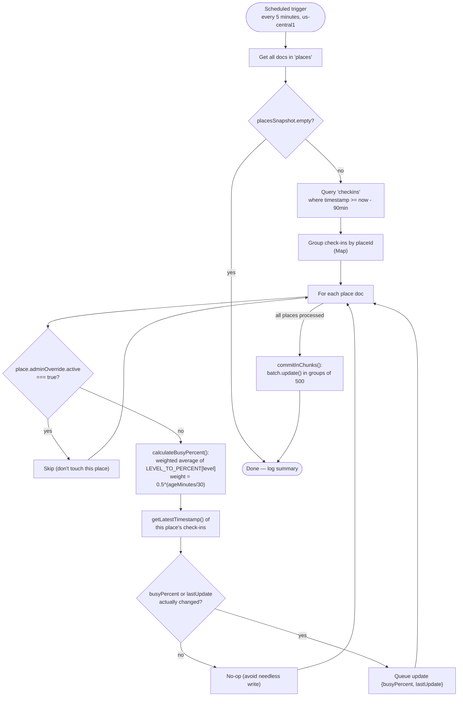

**The decay formula**, in plain terms: a check-in from *right now* has weight `1.0`; a check-in from 30 minutes ago has weight `0.5`; one from 60 minutes ago has weight `0.25`; anything older than 90 minutes is excluded entirely. This makes `busyPercent` a *recency-weighted moving average*, so a burst of "very busy" reports 80 minutes ago barely affects the current number, while a report from 2 minutes ago dominates it.

| Level | Meaning | Percent value |
|---|---|---|
| 1 | Not busy | 0 |
| 2 | Moderate | 50 |
| 3 | Very busy | 100 |

---

## 12. Scheduled cleanup algorithm (`cleanupOldCheckins`, every 60 minutes)

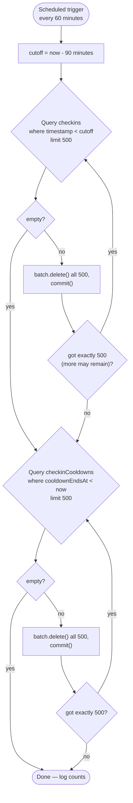

**Pagination pattern worth learning:** rather than deleting everything in one unbounded query (which could exceed Firestore's 500-writes-per-batch limit or time out), the function loops with `limit(500)` and only stops once a page comes back with fewer than 500 results. This is a standard cursor-free pagination trick for bulk deletes.

---

## 13. Firestore entity-relationship model

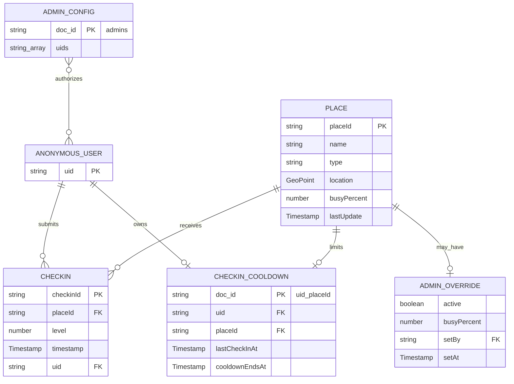

### Firestore access matrix

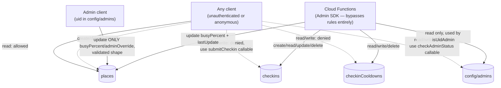

Dashed arrows = attempted access the security rules reject outright.

---

## 14. Security model — defense in depth

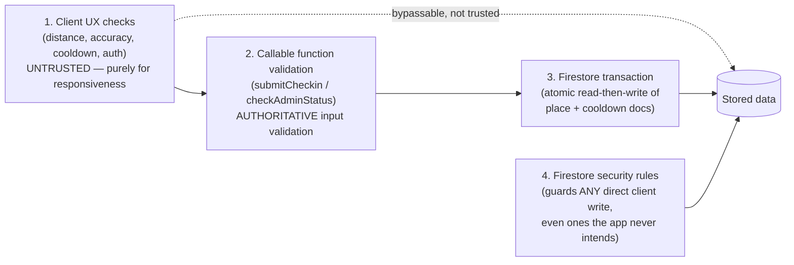

| Layer | File | What it stops |
|---|---|---|
| Client checks | [`app/place/[id].tsx`](../app/place/[id].tsx), [`services/checkInService.ts`](../services/checkInService.ts) | Nothing on its own — just improves UX / avoids obviously-doomed network calls |
| Callable validation | [`functions/src/index.ts`](../functions/src/index.ts) | Malformed input, wrong types, out-of-range values, missing auth |
| Firestore transaction | same file, `db.runTransaction(...)` | Race conditions — two simultaneous check-ins from the same uid+place can't both slip past the cooldown check |
| Security rules | [`firestore.rules`](../firestore.rules) | Any direct Firestore SDK write that skips the callable entirely (e.g. a modified client binary talking straight to Firestore) |

### Rule helper functions (class-diagram style summary)

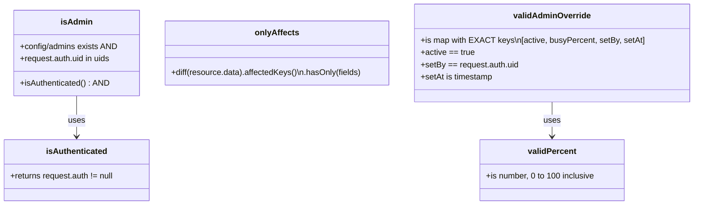

`onlyAffects(['busyPercent', 'adminOverride'])` is the field-level security trick: even a legitimate admin, using their own legitimate credentials, physically cannot change `place.name` or `place.location` through this rule path — the diff between old and new document is inspected key-by-key.

---

## 15. Deployment & tooling

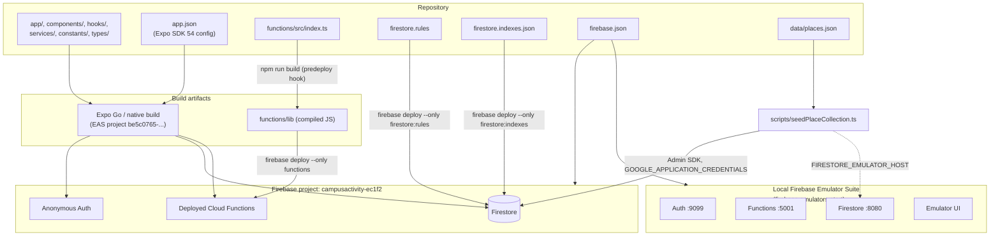

### Operational scripts

```mermaid
flowchart LR
    seed["seedPlaceCollection.ts\nbatch-writes places from JSON"] --> placesCol[("places")]
    test["testCheckInFunction.ts\nAdmin SDK test utility —\nBYPASSES auth/proximity/callable validation"] --> checkinsCol[("checkins")]
    test --> localAgg["local copy of the decay\naggregation logic"] --> placesCol
    cleanupScript["cleanupCheckInTestData.ts\ndeletes only uid='test-script' docs"] --> checkinsCol
```

**Important operational note:** `testCheckInFunction.ts` intentionally writes directly to `checkins` using the Admin SDK — it is a developer testing tool, not a code path any real user can reach (the security rules block `checkins` writes for normal clients; only the Admin SDK, used by Cloud Functions and this script, can write there).

### Runtime facts worth knowing

- `config/firebase.ts` contains a **public** client config (`apiKey`, `projectId`, etc.) — this is normal for Firebase web/mobile apps and is not a secret; security comes from rules + callable validation, not from hiding these values.
- The client never calls `connectAuthEmulator` / `connectFirestoreEmulator` / `connectFunctionsEmulator`, so running `firebase emulators:start` does **not** automatically redirect the running app to local emulators.
- There's no `.firebaserc` committed, so `firebase deploy` depends on the developer's local CLI project selection or an explicit `--project` flag.
- `app.json` declares `output: "static"` for web and `npm run web` exists, but `react-native-maps` (used by `MapScreen`) makes the web target effectively non-functional for the core feature — this is primarily a mobile (iOS/Android) app.

---

## 16. Design tokens (`constants/theme.ts`)

```mermaid
classDiagram
    class COLORS {
        +primary[50..900] : crimson scale
        +secondary[50..900] : teal scale
        +accent[50..900] : amber scale
        +status : green/yellow/red (+Light variants)
        +neutral[0..900] : warm gray scale
    }
    class SEMANTIC_COLORS {
        +background : primary/warm/card/overlay
        +text : primary/secondary/tertiary/inverse
        +interactive : primary/secondary/disabled states
        +border : light/default/focus
    }
    class FONTS {
        +display : Outfit_500/600/700
        +body : Figtree_400/600/700
    }
    class SPACING {
        +scale : 0,4,8,12,16,20,24,32,40,48,64
    }
    class RADIUS {
        +sm..2xl, full
    }
    class SHADOWS {
        +sm, md, lg, primaryGlow, warm
    }
    class ANIMATION {
        +duration : fast/normal/slow
        +spring : damping/stiffness/mass
        +pressScale : 0.97
    }
    class getBusyStatus {
        +percent number
        +returns color, label, lightBg, emoji
    }

    SEMANTIC_COLORS --> COLORS : derived from
    getBusyStatus --> COLORS : reads CONFIG.BUSY_THRESHOLDS
```

`getBusyStatus(percent)` is the single source of truth for how a busy percentage becomes a color/label/emoji (`<=30%` green "Not Busy", `<=60%` yellow "Moderate", else red "Busy"). It's used by `PlaceCard`, `PlaceMarker`'s screen equivalent, and the detail screen's hero section.

---

## 17. Known dead code & implementation caveats

These were confirmed by grepping actual usage across the codebase — call these out explicitly since a lot of "system design" understanding comes from knowing what's *not* actually wired up:

| Symbol | Defined in | Actually imported by a screen/component? |
|---|---|---|
| `useProximity` | [`hooks/useProximity.ts`](../hooks/useProximity.ts) | **No.** `PlaceScreen` computes `isNearby`/distance inline with `haversineDistance` instead. |
| `getPlaceById` | [`services/placeService.ts`](../services/placeService.ts) | **No.** The detail screen uses `subscribePlace` (realtime) exclusively. |
| `getNearbyPlaces`, `findNearbyPlace` | [`services/proximityService.ts`](../services/proximityService.ts) | **No.** Only `calculateProximityForAllPlaces` and `isAccuracyGoodEnough` are reachable, and only through the unused `useProximity`. |
| `CONFIG.LOCATION_UPDATE_INTERVAL`, `MINIMUM_DISTANCE_TO_UPDATE_LOCATION`, `MINIMUM_ACCURACY_TO_UPDATE_LOCATION` | [`constants/config.ts`](../constants/config.ts) | **No.** `locationService.watchLocation` hardcodes its own defaults (`5000`ms / `10`m) that happen to match two of these values by coincidence, not by import. |
| `BUSY_LEVEL_ICONS`, `BUSY_COLORS` | [`constants/theme.ts`](../constants/theme.ts) | **No.** Components define their own local emoji/color maps (see §3's note about `PLACE_TYPE_ICONS` duplication) instead of importing these. |

Other caveats worth knowing while reading the source:

- `mapPlaceDocument` requires an **exact lowercase** match against the 9-value `PLACE_TYPE` set — a typo'd `type` field in Firestore silently drops the whole place from every list/map.
- `adminService.checkIsAdmin` converts *any* failure (network error, function cold-start timeout, etc.) to `false` — a transient failure is indistinguishable from "not an admin" in the UI.
- `adminOverride.setBy` (an admin's UID) is stored inside the publicly-readable `places` document, so it's technically exposed to any client reading that place, even though `config/admins` itself is fully locked down.
- `StaleIndicator` compares `Date.now()` at render time only — it won't automatically re-render exactly when data crosses the 90-minute stale threshold; it just happens to look right on the next unrelated re-render (e.g. the next Firestore snapshot).
- The device's submitted GPS coordinates are used only to validate distance server-side and are **never stored** — the `checkins` document only persists `placeId`, `level`, `timestamp`, and `uid`.

---

## 18. Reading guide (suggested order through the actual source)

1. [`app/_layout.tsx`](../app/_layout.tsx) — global navigation shell, font loading, error boundary.
2. [`hooks/useAuth.ts`](../hooks/useAuth.ts) + [`services/authService.ts`](../services/authService.ts) — the shared external-store pattern, applied to Firebase Auth.
3. [`hooks/useLocation.ts`](../hooks/useLocation.ts) — the same pattern applied to a native device API with foreground/background lifecycle concerns.
4. [`services/placeService.ts`](../services/placeService.ts) — realtime Firestore snapshots turned into validated domain objects.
5. [`services/checkInService.ts`](../services/checkInService.ts) → [`functions/src/index.ts`](../functions/src/index.ts) — compare the "fast but untrusted" client checks against the "slow but authoritative" server checks.
6. [`firestore.rules`](../firestore.rules) — the final, unbypassable permission layer; read the comments, they're written as a mini security-rules tutorial.
7. `aggregateBusyPercent` and `cleanupOldCheckins` in [`functions/src/index.ts`](../functions/src/index.ts) — how raw events (`checkins`) become a derived read model (`places.busyPercent`), and how retention is enforced over time.

If you read those seven files in order, you'll have touched every architectural pattern in this document: shared external stores, service-layer adapters, defense-in-depth security, and event-sourced derived data.
