# Campus Spots: UML System Design

This document describes the architecture implemented in the repository today. It is intentionally organized as smaller UML-style views rather than one unreadable diagram. Source code, Firebase rules, and deployed-function logic are authoritative over older planning documents.

Named screen implementations live in `screens/`; route files re-export them. `functions/src/index.ts` re-exports the four deployment names from callable and scheduled modules. See [the cost walkthrough](firebase-costs.md) for the sparse aggregation queries, resource settings, and listener lifecycle.

The diagrams use Mermaid syntax. Open them in an editor or Markdown viewer with Mermaid support and read them from left to right.

## 1. System at a glance

Campus Spots is an Expo React Native application backed by Firebase:

- Expo Router owns navigation and screen composition.
- Hooks expose shared auth, location, places, cooldown, proximity, and admin state.
- Services isolate Firebase, Expo Location, AsyncStorage, and distance calculations.
- Firestore is the realtime data store.
- Callable Cloud Functions are the security boundary for check-ins and admin-status lookup.
- Scheduled Cloud Functions aggregate recent reports and clean up expired data.
- Local scripts seed places and can simulate the aggregation pipeline with Admin SDK access.

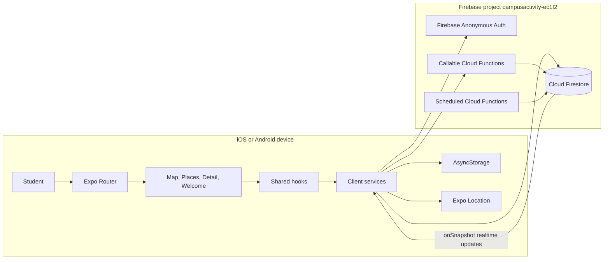

### Main modules

| Area                | Implementation                                                                                                                                                                                                     |
| ------------------- | ------------------------------------------------------------------------------------------------------------------------------------------------------------------------------------------------------------------ |
| Root navigation     | [`app/_layout.tsx`](../app/_layout.tsx)                                                                                                                                                                            |
| Startup redirect    | [`app/index.tsx`](../app/index.tsx)                                                                                                                                                                                |
| Screens             | [`app/(tabs)/index.tsx`](<../app/(tabs)/index.tsx>), [`app/(tabs)/places.tsx`](<../app/(tabs)/places.tsx>), [`app/place/[id].tsx`](../app/place/[id].tsx), [`app/(auth)/welcome.tsx`](<../app/(auth)/welcome.tsx>) |
| Shared state        | [`hooks/`](../hooks/)                                                                                                                                                                                              |
| Client integrations | [`services/`](../services/), [`config/firebase-client.ts`](../config/firebase-client.ts)                                                                                                                                         |
| Domain types/config | [`types/domain.ts`](../types/domain.ts), [`constants/app-config.ts`](../constants/app-config.ts)                                                                                                                             |
| Server functions    | [`functions/src/index.ts`](../functions/src/index.ts)                                                                                                                                                              |
| Database security   | [`firestore.rules`](../firestore.rules)                                                                                                                                                                            |

## 2. Client component and dependency view

This is a component diagram in practical form. Screens depend on hooks; hooks depend on services; services depend on platform or Firebase adapters.

```mermaid
flowchart TB
    subgraph navigation [Expo Router]
        root[RootLayout]
        index[Index redirect]
        welcome[Welcome screen]
        tabs[Tabs layout]
        map[Map screen]
        places[Places screen]
        detail[Place detail screen]
    end

    subgraph shared [Shared hooks]
        authHook[useAuth]
        locationHook[useLocation]
        placesHook[useLivePlaces]
        checkinHook[usePlaceCheckIn]
        adminHook[useAdminPermissions]
        proximityHook[usePlaceProximity]
    end

    subgraph client [Client services]
        auth-service[auth-service]
        location-service[location-service]
        place-service[place-service]
        checkinService[check-in-service]
        admin-service[admin-service]
        proximity-service[proximity-service]
        distance[distance utilities]
    end

    subgraph components [Reusable UI]
        marker[PlaceMarker]
        card[PlaceCard]
        buttons[CrowdLevelButtons]
        timer[CooldownTimer]
        stale[StaleCrowdIndicator]
        adminPanel[AdminOverridePanel]
        tabBar[FloatingTabBar]
    end

    root --> authHook
    index --> locationHook
    welcome --> locationHook
    tabs --> tabBar
    map --> placesHook
    map --> locationHook
    map --> marker
    places --> placesHook
    places --> card
    detail --> authHook
    detail --> locationHook
    detail --> checkinHook
    detail --> adminHook
    detail --> marker
    detail --> buttons
    detail --> timer
    detail --> stale
    detail --> adminPanel

    authHook --> auth-service
    locationHook --> location-service
    placesHook --> place-service
    checkinHook --> checkinService
    adminHook --> admin-service
    proximityHook --> proximity-service
    proximity-service --> distance
    detail --> distance
```

### Important implementation patterns

1. [`useAuth`](../hooks/useAuth.ts), [`useLocation`](../hooks/useLocation.ts), and [`useLivePlaces`](../hooks/useLivePlaces.ts) use `useSyncExternalStore`-style shared state. Multiple screens observe one subscription instead of creating independent auth/location/place listeners.
2. Services keep Firebase and native APIs out of most UI components. This makes screens mostly orchestration and rendering code.
3. [`usePlaceProximity`](../hooks/usePlaceProximity.ts), [`getPlaceById`](../services/place-service.ts), and several config/theme helpers are implemented secondary paths; the current main detail screen calculates its distance directly and uses `subscribePlace`.

## 3. Shared external-store lifecycles

The app uses module-level stores with `useSyncExternalStore`, rather than React Context or a state-management package, for auth, location, and the places collection. The store owns the external subscription and stops it when the last React consumer unsubscribes.

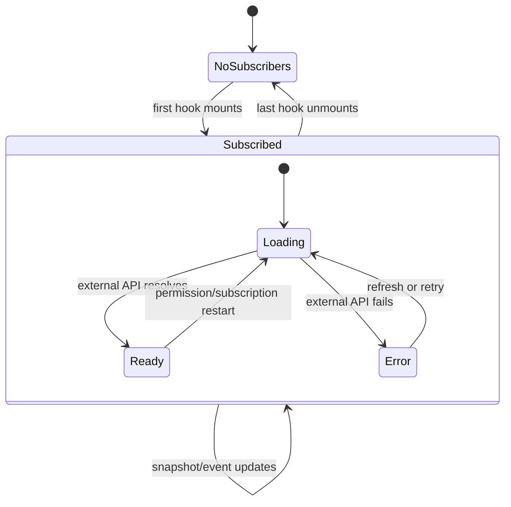

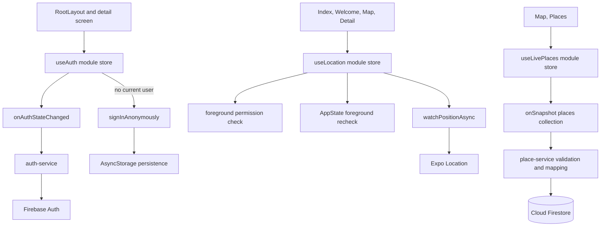

### Store ownership and cleanup

- `useAuth` keeps one Firebase auth listener and coalesces concurrent anonymous sign-in attempts.
- `useLocation` keeps one foreground location watcher, removes it when there are no listeners, and rechecks permission when the app returns to the foreground.
- `useLivePlaces` keeps one shared collection listener and exposes `refresh()` as a subscription restart. `services/place-subscriptions.ts` shares it with details and closes database listeners while backgrounded.
- `usePlaceCheckIn` and `useAdminPermissions` keep screen-local React state because their state is scoped to one detail screen.

## 4. Navigation, startup, authentication, and location

Authentication and location are separate concerns. The root layout waits for the first auth resolution, while the startup route decides whether to show onboarding based on location permission.

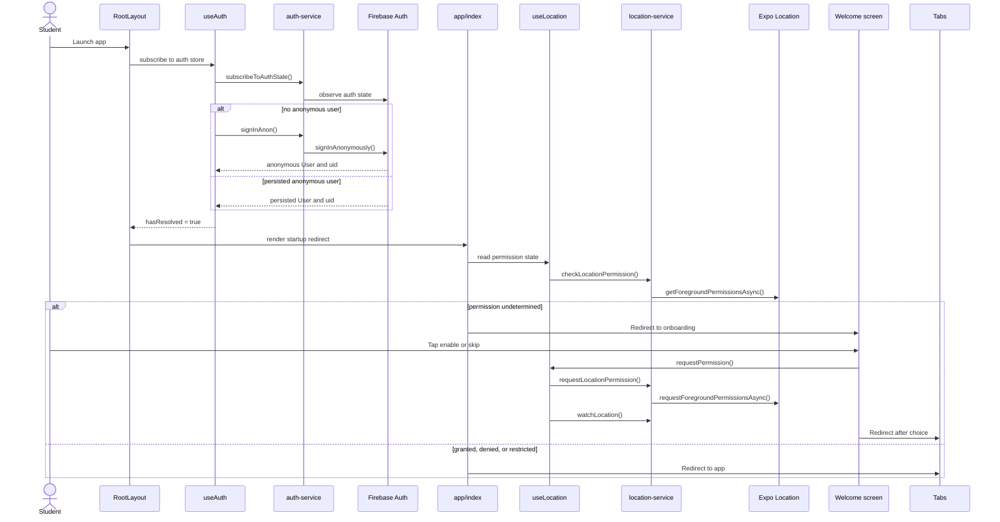

### State rules

- Anonymous auth is automatic and persisted with AsyncStorage; there is no email/password form.
- Location is requested only for foreground use.
- Denied or restricted location does not prevent browsing places. It disables check-in and gives the user an Open Settings action.
- The detail screen requires both a resolved auth user and a usable location before a check-in can be enabled.

## 5. Realtime places and screen rendering

Places are seeded from JSON, but the runtime source of truth is Firestore. Map, list, and detail views receive realtime snapshots through the place service.

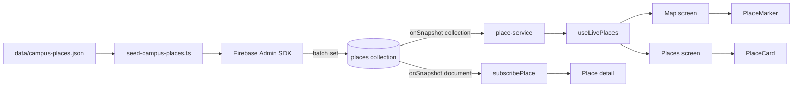

### Place document to UI model

[`mapPlaceDocument`](../services/place-service.ts) validates the Firestore document before exposing it as a [`Place`](../types/domain.ts):

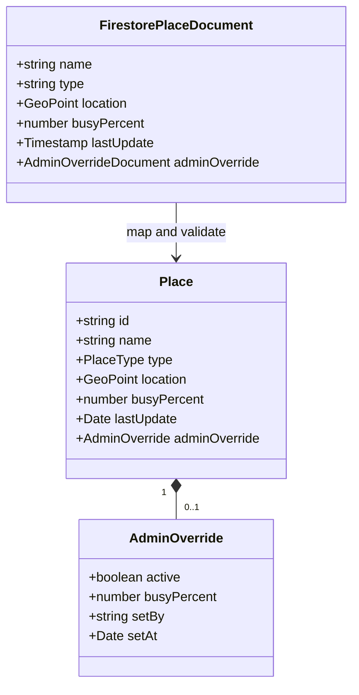

The busy label is derived from `busyPercent` by [`constants/theme-tokens.ts`](../constants/theme-tokens.ts). The stale indicator uses `lastUpdate`, or the override timestamp while an override is active.

## 6. Check-in sequence

The client performs checks for fast feedback, but the Cloud Function repeats the security-critical checks. A direct client write to `checkins` is denied by Firestore rules.

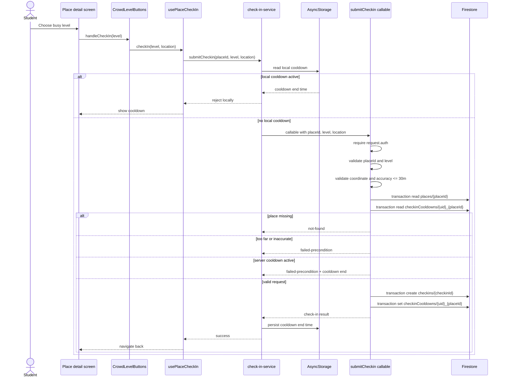

### Why validation exists twice

The client gates `canCheckIn` using distance, accuracy, auth, and cooldown state so the UI is responsive. Those checks are not trusted because a user can bypass the app and call Firebase directly. [`functions/src/callable/submit-check-in.ts`](../functions/src/callable/submit-check-in.ts) is the authoritative gate:

- radius: 50 meters;
- required accuracy: 30 meters or better;
- accepted levels: `1`, `2`, or `3`;
- one check-in per anonymous UID and place every 90 minutes;
- submitted coordinates are used for validation and are not stored.

## 7. Scheduled aggregation and retention

The app does not calculate the global busy percentage on every client. Scheduled backend jobs derive it from recent reports and publish the result back to `places`.

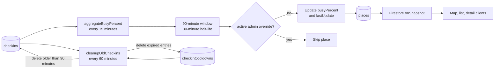

### Aggregation algorithm

[`crowd-calculation.ts`](../functions/src/domain/crowd-calculation.ts) maps report levels to percentages:

| Report level    | Percent value |
| --------------- | ------------- |
| `1` — not busy  | `0`           |
| `2` — moderate  | `50`          |
| `3` — very busy | `100`         |

Each report is weighted by exponential decay:

`weight = 0.5 ^ (ageMinutes / 30)`

The weighted average is rounded and written to the place only when `busyPercent` or `lastUpdate` changes. Active admin overrides are skipped.

## 8. Admin authorization and overrides

Admin authorization has two layers:

1. The callable function returns a boolean so the client can decide whether to render the admin panel.
2. Firestore rules independently validate any direct place update, including the UID, allowed fields, percentage, and timestamp.

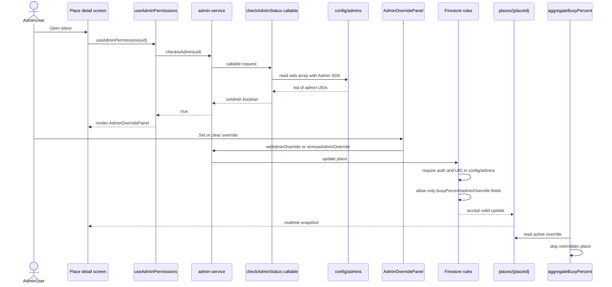

### Admin data shape

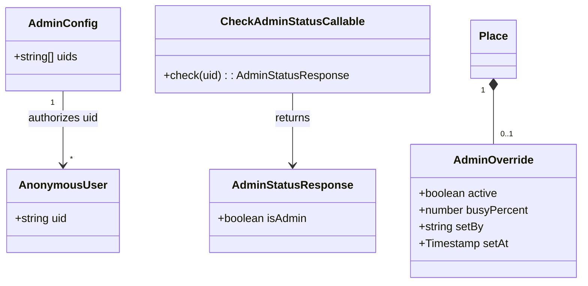

The client cannot read `config/admins`; it only receives the boolean response. The Firebase Console or Admin SDK is the configuration path for adding UIDs.

## 9. Firestore entity and relationship model

This model separates stored data from derived client models and identifies which actor writes each collection.

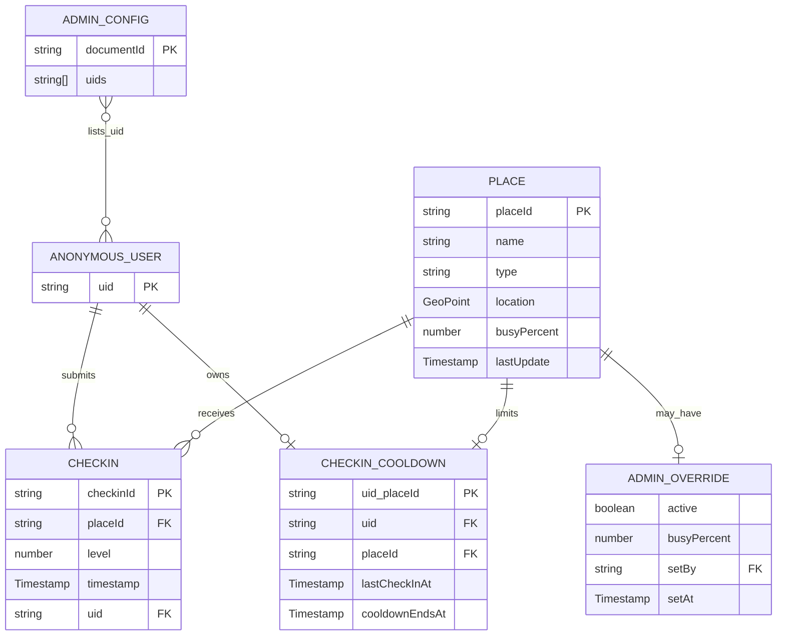

### Firestore access matrix

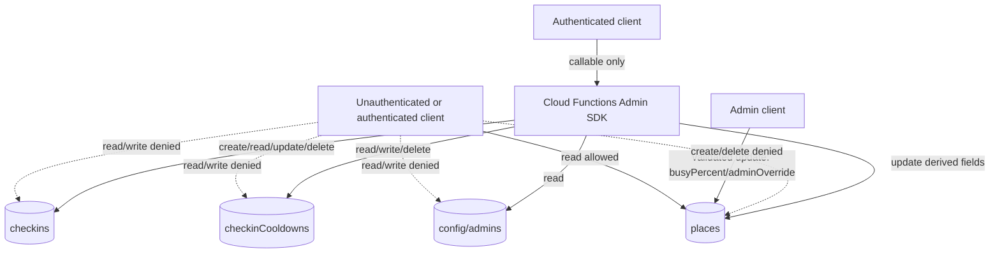

The dashed relationships represent attempted client access that the rules reject. Cloud Functions use the Admin SDK and therefore perform their own validation before writing.

## 10. Deployment, seeding, test tooling, and local emulators

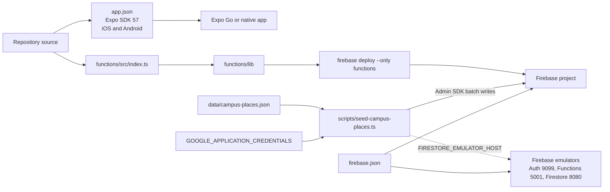

### Runtime and operational notes

- The client Firebase configuration in [`config/firebase-client.ts`](../config/firebase-client.ts) identifies the Firebase project; it is not a service-account secret.
- The seed script requires a real service-account credential outside the emulator. Service-account JSON files are ignored by [`.gitignore`](../.gitignore).
- `firebase.json` runs the Functions TypeScript build before deployment.
- The app targets iOS and Android and depends on `react-native-maps`.
- The repository has no `.firebaserc`, so Firebase CLI project selection depends on the developer's external CLI state or an explicit `--project`.
- The development client connects to the three emulators when `EXPO_PUBLIC_USE_FIREBASE_EMULATORS=true`; `.env.example` documents the host setting. Starting emulators alone does not select them in the app.

### Operational scripts and index usage

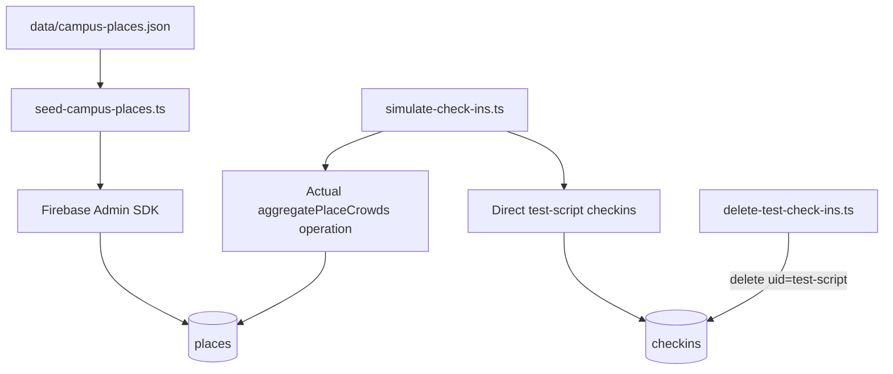

- `seed-campus-places.ts` writes the initial place documents in one batch and converts JSON coordinates to Firestore `GeoPoint` values.
- `simulate-check-ins.ts` intentionally bypasses authentication, proximity, and callable validation; it is an Admin SDK test utility, not a production client path.
- `delete-test-check-ins.ts` removes only test check-ins. It does not remove cooldown documents or reset affected place summaries.
- `firestore.indexes.json` retains the existing `checkins(placeId, timestamp)` indexes. Current sparse aggregation and cleanup use single-field queries; the simulator calls the same aggregation operation.

## 11. Cross-cutting behavior

### Error boundary

[`components/AppErrorBoundary.tsx`](../components/AppErrorBoundary.tsx) wraps the root navigator. Render-time React errors are caught at the app boundary and replaced with a retry UI instead of taking down the entire navigation tree.

### Privacy and retention

- Anonymous Auth creates an app-scoped UID instead of collecting a user profile.
- Device location is used to calculate proximity and accuracy; it is sent to `submitCheckin` for validation and is not stored as a location history.
- Check-in reports and cooldown state are logically valid for a 90-minute window; the hourly cleanup function removes expired records, so physical deletion can lag the 90-minute boundary.
- Public place reads expose campus place records, derived busy status, and any active `adminOverride` fields, including `setBy`; the admin UID list itself remains private.

### Defense in depth

The production security model is:

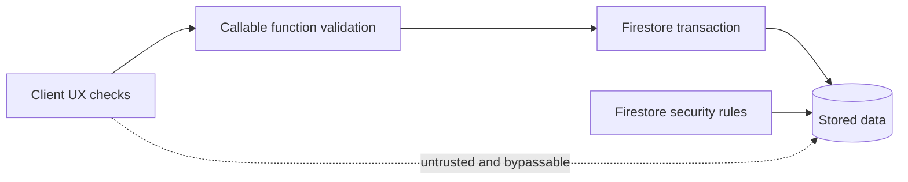

The client is optimized for feedback, the callable function is the authoritative check-in API, transactions protect the coupled writes, and rules protect direct Firestore access.

## 12. Reading guide for a CS student

1. Start at [`app/_layout.tsx`](../app/_layout.tsx) to see how a React Native app establishes global navigation and an error boundary.
2. Follow [`hooks/useAuth.ts`](../hooks/useAuth.ts) and [`services/auth-service.ts`](../services/auth-service.ts) to see a shared external store and Firebase Auth persistence.
3. Follow [`services/place-service.ts`](../services/place-service.ts) to see how realtime snapshots are validated and mapped into domain types.
4. Follow [`services/check-in-service.ts`](../services/check-in-service.ts) into [`functions/src/index.ts`](../functions/src/index.ts) to compare client convenience checks with server authority.
5. Read [`firestore.rules`](../firestore.rules) as the final direct-database permission layer.
6. Read `aggregateBusyPercent` and `cleanupOldCheckins` to see how event data becomes a derived read model and how retention is enforced.

## 13. Implementation caveats and source-of-truth note

The diagrams above follow the current implementation. If an older planning document describes direct client writes to `checkins`, a smaller radius, or direct client reads of `config/admins`, treat the code and rules referenced here as authoritative:

- [`functions/src/index.ts`](../functions/src/index.ts)
- [`firestore.rules`](../firestore.rules)
- [`services/check-in-service.ts`](../services/check-in-service.ts)
- [`services/admin-service.ts`](../services/admin-service.ts)
- [`package.json`](../package.json) and [`app.json`](../app.json)

Additional implementation caveats worth knowing:

- Expo permission normalization maps the platform's denied result to `denied`; the `restricted` union value is retained in the domain model but is effectively unreachable through `location-service.ts`.
- `MapScreen` uses `initialRegion`, so a GPS fix arriving after mount updates the user indicator but does not automatically recenter the map.
- `StaleCrowdIndicator` evaluates `Date.now()` during render; it does not schedule a render exactly at the stale threshold.
- `useLocation` reports watcher creation errors, but the watcher is not automatically retried when permission remains unchanged.
- `CONFIG.LOCATION_UPDATE_INTERVAL`, `MINIMUM_DISTANCE_TO_UPDATE_LOCATION`, and `MINIMUM_ACCURACY_TO_UPDATE_LOCATION` exist but `watchLocation` currently uses its own defaults.
- `admin-service.checkIsAdmin` converts lookup failures to `false`, so a transient failure is indistinguishable from a non-admin result in the UI.
- `mapPlaceDocument` silently skips malformed place documents and requires exact lowercase values from the `PlaceType` union.
- The client-side cooldown in `AsyncStorage` improves UX but is not authoritative; the server transaction enforces the real cooldown.
- `adminOverride.setBy` is stored inside publicly readable `places` documents, so individual admin UIDs can be exposed even though `config/admins` is denied to clients.
- The public Firebase client configuration is expected in a client bundle; authorization depends on callable validation and Firestore rules, not on hiding those values.
